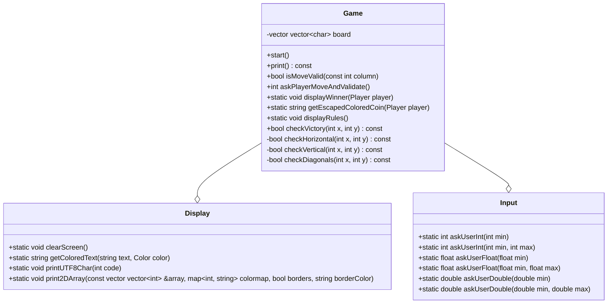

# Refactoring of Puissance 4
From https://github.com/HEIGVD-PRG1-F-2022/lab-03-puissance-4-quentin-guillaumed



## Enums
```cpp
enum class Player { EMPTY, YELLOW, RED };
enum class Color { RED, GREEN, YELLOW, BLUE, MAGENTA, CYAN, WHITE};
```
